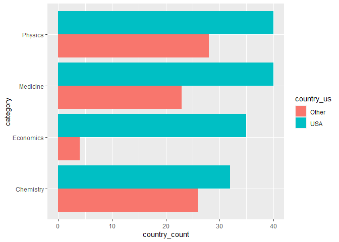
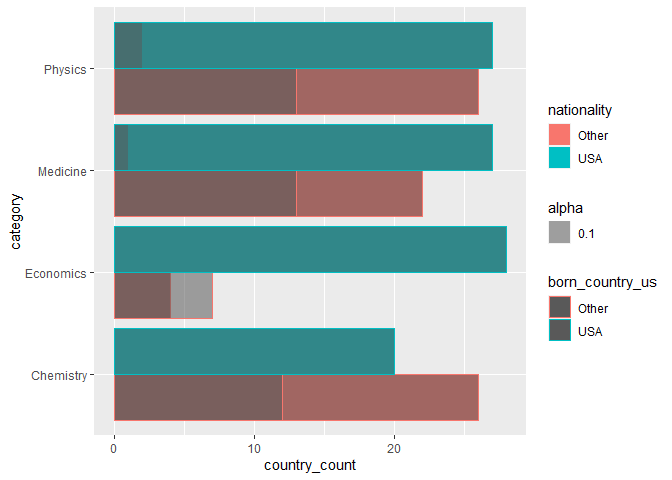
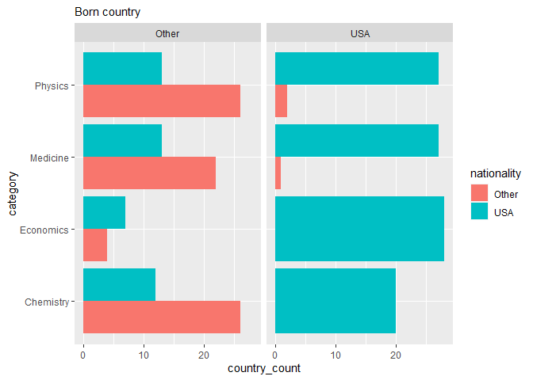

Lab 03 - Nobel laureates
================
Qilin
1/14/2023

### Load packages and data

``` r
library(tidyverse) 
```

``` r
nobel <- read_csv("data/nobel.csv")
```

## Exercises

### Exercise 1

``` r
dim(nobel)
```

    ## [1] 935  26

``` r
#for getting the number of observations and variables
print(nobel)
```

    ## # A tibble: 935 × 26
    ##       id firstname      surname    year categ…¹ affil…² city  country born_date 
    ##    <dbl> <chr>          <chr>     <dbl> <chr>   <chr>   <chr> <chr>   <date>    
    ##  1     1 Wilhelm Conrad Röntgen    1901 Physics Munich… Muni… Germany 1845-03-27
    ##  2     2 Hendrik A.     Lorentz    1902 Physics Leiden… Leid… Nether… 1853-07-18
    ##  3     3 Pieter         Zeeman     1902 Physics Amster… Amst… Nether… 1865-05-25
    ##  4     4 Henri          Becquerel  1903 Physics École … Paris France  1852-12-15
    ##  5     5 Pierre         Curie      1903 Physics École … Paris France  1859-05-15
    ##  6     6 Marie          Curie      1903 Physics <NA>    <NA>  <NA>    1867-11-07
    ##  7     6 Marie          Curie      1911 Chemis… Sorbon… Paris France  1867-11-07
    ##  8     8 Lord           Rayleigh   1904 Physics Royal … Lond… United… 1842-11-12
    ##  9     9 Philipp        Lenard     1905 Physics Kiel U… Kiel  Germany 1862-06-07
    ## 10    10 J.J.           Thomson    1906 Physics Univer… Camb… United… 1856-12-18
    ## # … with 925 more rows, 17 more variables: died_date <date>, gender <chr>,
    ## #   born_city <chr>, born_country <chr>, born_country_code <chr>,
    ## #   died_city <chr>, died_country <chr>, died_country_code <chr>,
    ## #   overall_motivation <chr>, share <dbl>, motivation <chr>,
    ## #   born_country_original <chr>, born_city_original <chr>,
    ## #   died_country_original <chr>, died_city_original <chr>, city_original <chr>,
    ## #   country_original <chr>, and abbreviated variable names ¹​category, …

``` r
#for understanding what each row represent
```

935 observations and 26 variables Each row represents a single
observation/a single entry of Nobel Laureates

### Exercise 2

``` r
nobel_living <- nobel %>%
  filter(!is.na(country), gender != "org", is.na(died_date))

nrow(nobel_living) #double check if there are 228 observations
```

    ## [1] 228

### Exercise 3

``` r
nobel_living <- nobel_living %>%
  mutate(
    country_us = if_else(
      country == "USA", "USA", "Other"
      )
    )

nobel_living_science <- nobel_living %>%
  filter(category %in% c("Physics", "Medicine", "Chemistry", "Economics"))

graph <- nobel_living_science %>%
  group_by(category,country_us) %>%
  summarize(country_count = table(country_us))

ggplot(graph, mapping = aes(y= category, x= country_count, fill = country_us))+
  geom_bar(position = "dodge", stat = "identity") 
```

<!-- -->

``` r
rm(graph)
```

From the bar chart, it seems like most of the living Nobel laureates are
from the US, which countered the topic of the Buzzfeed, at least in the
literal sense. However, the data does not tell whether winners from the
US are immigrants.

### Exercise 4

``` r
#science winners
nobel_living_science <- nobel_living_science %>%
  mutate(born_country_us = 
           ifelse(born_country == "USA","USA","Other"
  )
)

table(nobel_living_science$born_country_us)
```

    ## 
    ## Other   USA 
    ##   123   105

``` r
#all winners
nobel$born_country_us <- ifelse(nobel$born_country == "USA","USA","Other")

table(nobel$born_country_us)
```

    ## 
    ## Other   USA 
    ##   636   271

271 Winners were born in the US among all winners.

105 winners were born in the us among science winners.

### Exercise 5

``` r
graph2 <- nobel_living_science %>%
  group_by(category,country_us,born_country_us) %>%
  summarize(country_count = table(country_us))
```

    ## `summarise()` has grouped output by 'category', 'country_us'. You can override
    ## using the `.groups` argument.

``` r
#smashed/failed version :(
ggplot(graph2)+
  geom_bar(position = "dodge",stat = "identity",mapping = aes(y= category, x= country_count, fill =country_us))+
  geom_bar(position = "dodge", mapping = aes(y= category, x= country_count, color = born_country_us, alpha = 0.1), stat = "identity")+
  scale_fill_discrete(name  ="nationality")
```

    ## Don't know how to automatically pick scale for object of type <table>.
    ## Defaulting to continuous.

<!-- -->

``` r
#facet_wrap version
ggplot(graph2)+
  geom_bar(position = "dodge",stat = "identity",mapping = aes(y= category, x= country_count, fill =country_us))+
  facet_grid(cols = vars(born_country_us))+
  scale_fill_discrete(name  ="nationality")+
  labs(subtitle = "Born country")
```

    ## Don't know how to automatically pick scale for object of type <table>.
    ## Defaulting to continuous.

<!-- -->

``` r
rm(graph2)
```

Seem like immigrants do take up some Nobel Laureates in the US. However,
their number did not exceed those NObel Laureates who are originally
from the US.

### Exercise 6

``` r
nobel %>%
  filter(country == "USA", born_country != "USA") %>%
  count(born_country)%>%
  arrange(desc(n))
```

    ## # A tibble: 37 × 2
    ##    born_country       n
    ##    <chr>          <int>
    ##  1 United Kingdom    15
    ##  2 Canada            12
    ##  3 Germany           10
    ##  4 China              6
    ##  5 Poland             6
    ##  6 France             5
    ##  7 Italy              5
    ##  8 Japan              5
    ##  9 Austria            4
    ## 10 Hungary            4
    ## # … with 27 more rows

UK is the most common.
